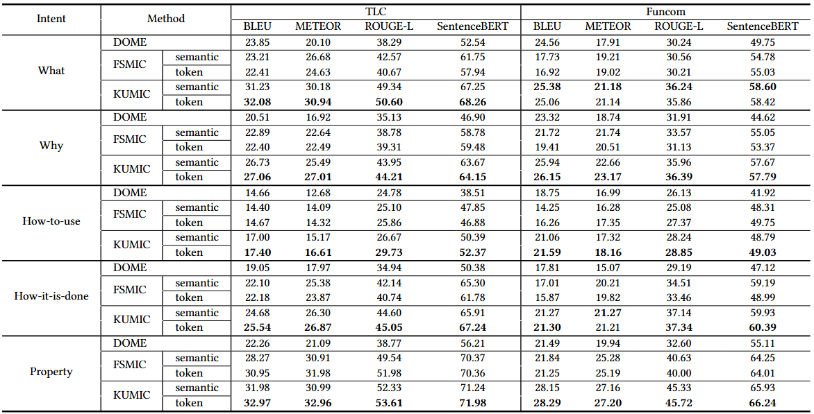
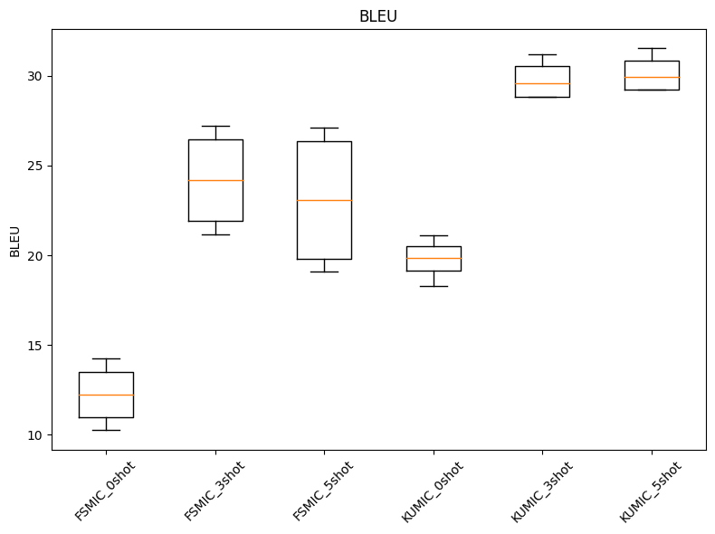
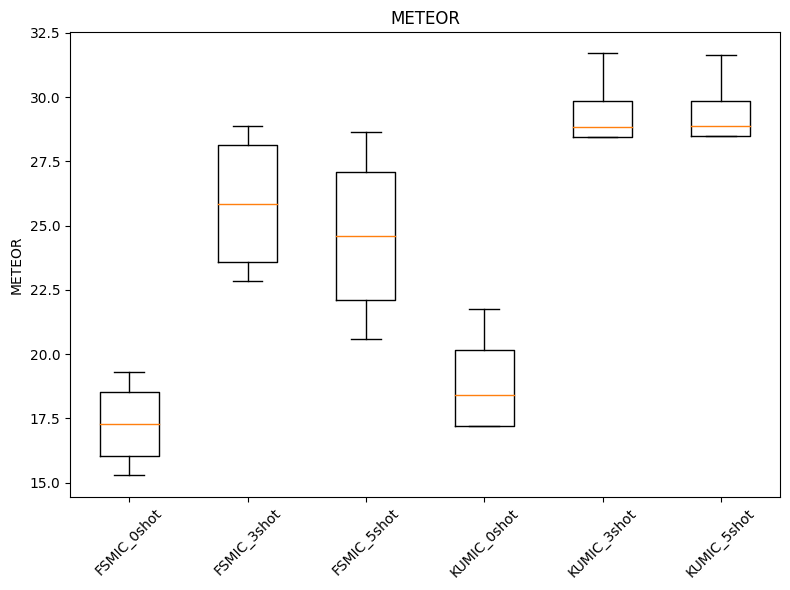
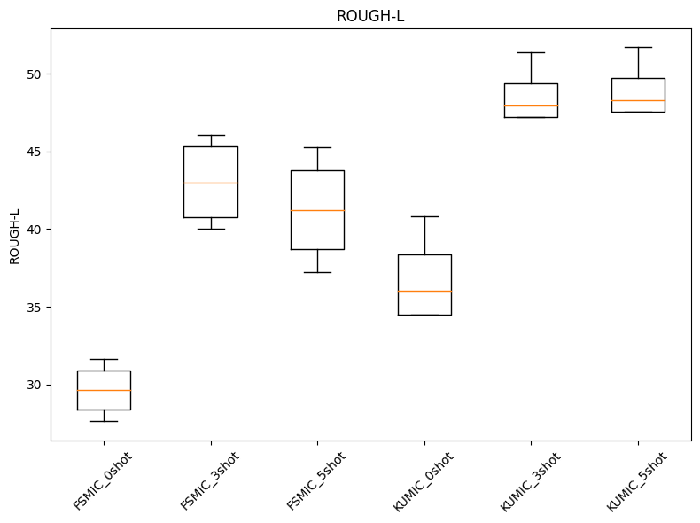
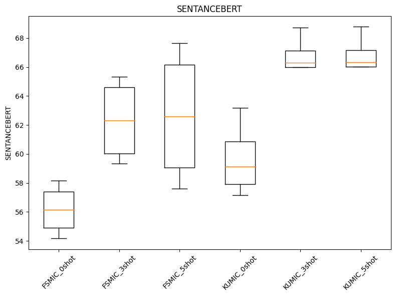
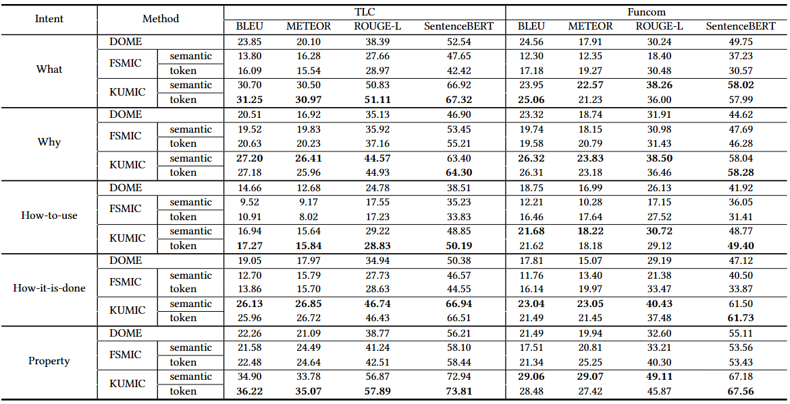
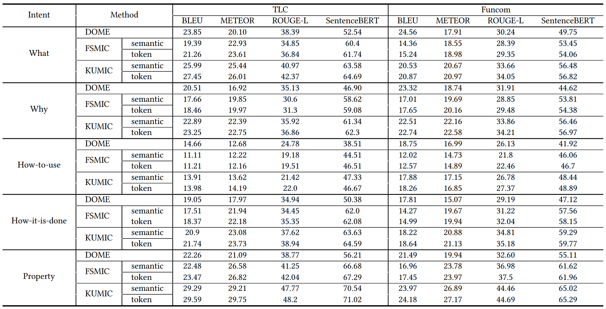
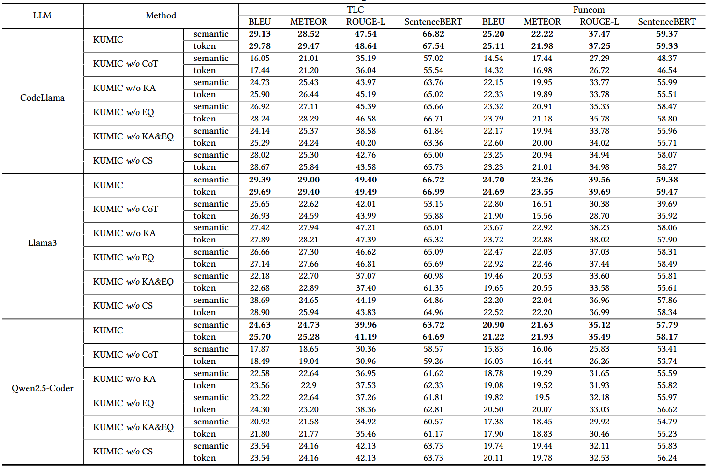
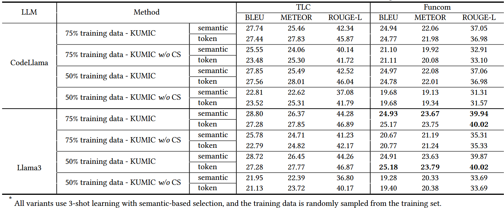
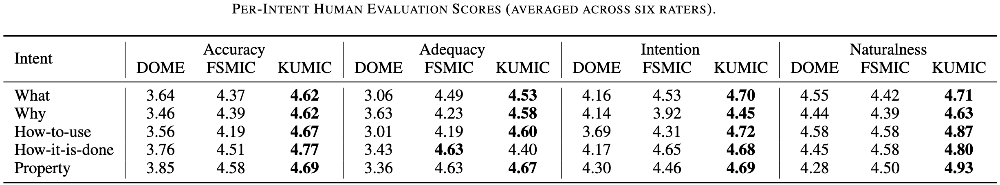

<!-- # 
Optimizing Knowledge Utilization for Multi-Intent Comment Generation with Large Language Modelsss

Our paper is available on -->


# De-duplication
This is the implementation of KUMIC ( Optimizing Knowledge Utilization for Multi-Intent Comment Generation with Large Language Models ).


## Abstract

Code comment generation aims to produce a generic overview of a code snippet, helping developers better understand and maintain code.
However, generic summaries alone are insufficient to meet the diverse needs of practitioners; for example, developers expect the implementation insights to be presented in an untangled manner, while users seek clear usage instructions.
This highlights the necessity of multi-intent comment generation.
With the widespread adoption of Large Language Models (LLMs) for code-related tasks, these models have been leveraged to tackle the challenge of multi-intent comment generation. 
Despite their successes, state-of-the-art LLM-based approaches often struggle to construct correct relationships among intents, code, and comments within a smaller number of demonstration examples.
To mitigate this issue, we propose a framework named KUMIC for multi-intent comment generation.
Built upon in-context learning, KUMIC leverages Chain-of-Thought (CoT) to optimize knowledge utilization for LLMs to generate intent-specific comments.
Specifically, KUMIC first designs a retrieval mechanism to obtain similar demonstration examples, which exhibit high code-comment consistency.
Then, KUMIC leverages CoT to guide LLMs to focus on statements facilitating the derivation of code comments aligned with specific intents.
In this context, KUMIC constructs a mapping knowledge chain — linking code to intent-specific statements to comments — which enables LLMs to follow similar reasoning steps when generating the desired comments.
We conduct extensive experiments to evaluate KUMIC, and the results demonstrate that KUMIC outperforms state-of-the-art baselines by 14.49\%, 22.41\%, 20.72\%, and 12.94\% in terms of BLEU, METEOR, ROUGE-L, and SBERT, respectively.


## Get Started
PyTorch 2.3.0 framework with Python 3.8. 
Experiments are conducted on a server equipped with four NVIDIA A800 GPU and 512 GB memory, running on Ubuntu 20.04.2.

OS: Ubuntu 20.04.  
package: PyTorch 2.3.0 framework with Python 3.8. 
The dataset we used are funcom.test, funcom.train, tlcodesum.test and tlcodesum.train.  

## Resultion. 
Despite their successes, state-of-the-art LLM-based approaches often struggle to construct correct relationships among intents, code, and comments within a smaller number of demonstration examples.
To mitigate this issue, we propose a framework named KUMIC for multi-intent comment generation.
Built upon in-context learning, KUMIC leverages Chain-of-Thought (CoT) to optimize knowledge utilization for LLMs to generate intent-specific comments.
Specifically, KUMIC first designs a retrieval mechanism to obtain similar demonstration examples, which exhibit high code-comment consistency.
Then, KUMIC leverages CoT to guide LLMs to focus on statements facilitating the derivation of code comments aligned with specific intents.
In this context, KUMIC constructs a mapping knowledge chain — linking code to intent-specific statements to comments — which enables LLMs to follow similar reasoning steps when generating the desired comments.
We conduct extensive experiments to evaluate KUMIC, and the results demonstrate that KUMIC outperforms state-of-the-art baselines by 18.37\%, 24.66\%, 22.25\%, and 12.95\% in terms of BLEU, METEOR, ROUGE-L, and SentenceBERT, respectively.


## Get Started
PyTorch 2.3.0 framework with Python 3.8. 
Experiments are conducted on a server equipped with four NVIDIA A800 GPU and 512 GB memory, running on Ubuntu 20.04.2.

OS: Ubuntu 20.04.  
package: PyTorch 2.3.0 framework with Python 3.8. 
The dataset we used are funcom.test, funcom.train, tlcodesum.test and tlcodesum.train.  

## Supplementary result
### The Supplementary Result of RQ1
Performances of KUMIC and baselines on each intent category on CodeLlama.


### Descriptive statistics across runs

#### BLEU

##### Semantic-based retrieval strategy
<table>
<tr>
<td valign="top" width="50%">

| Method      |  Mean | 95% CI         | Median |   P90 |
| ----------- | ----: | -------------- | -----: | ----: |
| FSMIC_0shot | 12.25 | [9.34, 15.16]  |  12.26 | 13.96 |
| FSMIC_3shot | 22.64 | [18.49, 26.79] |  22.63 | 25.05 |
| FSMIC_5shot | 23.63 | [17.18, 30.08] |  24.40 | 28.40 |
| KUMIC_0shot | 19.77 | [17.93, 21.61] |  19.85 | 20.93 |
| KUMIC_3shot | 29.13 | [27.28, 30.99] |  28.72 | 30.27 |
| KUMIC_5shot | 29.51 | [27.70, 31.33] |  29.10 | 30.63 |


</td>

<td valign="top" width="50%">



</td>
</tr>
</table>

##### Token-based retrieval strategy
<table>
<tr>
<td valign="top" width="50%">

| Method      |  Mean | 95% CI         | Median |   P90 |
| ----------- | ----: | -------------- | -----: | ----: |
| FSMIC_0shot | 12.25 | [9.34, 15.16]  |  12.25 | 13.96 |
| FSMIC_3shot | 22.63 | [18.48, 26.77] |  22.62 | 25.05 |
| FSMIC_5shot | 25.89 | [19.83, 31.94] |  27.39 | 28.40 |
| KUMIC_0shot | 19.78 | [18.18, 21.37] |  19.71 | 20.69 |
| KUMIC_3shot | 29.13 | [27.28, 30.99] |  28.92 | 30.27 |
| KUMIC_5shot | 29.51 | [27.70, 31.33] |  29.29 | 30.63 |

</td>

<td valign="top" width="50%">


</td>
</tr>
</table>

#### METEOR

##### Semantic-based retrieval strategy
<table>
<tr>
<td valign="top" width="50%">

| Method      |  Mean | 95% CI         | Median |   P90 |
| ----------- | ----: | -------------- | -----: | ----: |
| FSMIC_0shot | 17.28 | [14.36, 20.20] |  17.28 | 18.99 |
| FSMIC_3shot | 25.55 | [20.83, 30.27] |  25.55 | 28.28 |
| FSMIC_5shot | 26.01 | [18.40, 33.62] |  26.00 | 30.43 |
| KUMIC_0shot | 18.94 | [15.35, 22.53] |  18.40 | 21.12 |
| KUMIC_3shot | 28.52 | [26.07, 30.96] |  27.90 | 30.01 |
| KUMIC_5shot | 29.09 | [26.70, 31.48] |  28.68 | 30.56 |


</td>

<td valign="top" width="50%">


</td>
</tr>
</table>

##### Token-based retrieval strategy
<table>
<tr>
<td valign="top" width="50%">

| Method      |  Mean | 95% CI         | Median |   P90 |
| ----------- | ----: | -------------- | -----: | ----: |
| FSMIC_0shot | 17.28 | [14.36, 20.20] |  17.28 | 18.99 |
| FSMIC_3shot | 25.56 | [20.84, 30.28] |  25.55 | 28.28 |
| FSMIC_5shot | 26.01 | [18.40, 33.62] |  26.00 | 30.43 |
| KUMIC_0shot | 18.93 | [15.35, 22.52] |  18.00 | 21.12 |
| KUMIC_3shot | 28.52 | [26.07, 30.96] |  27.90 | 30.01 |
| KUMIC_5shot | 29.09 | [26.70, 31.48] |  28.50 | 30.56 |


</td>

<td valign="top" width="50%">



</td>
</tr>
</table>

#### Rough-L

##### Semantic-based retrieval strategy
<table>
<tr>
<td valign="top" width="50%">

| Method      |  Mean | 95% CI         | Median |   P90 |
| ----------- | ----: | -------------- | -----: | ----: |
| FSMIC_0shot | 29.62 | [26.68, 32.55] |  29.62 | 31.33 |
| FSMIC_3shot | 41.75 | [37.02, 46.49] |  41.74 | 44.49 |
| FSMIC_5shot | 42.41 | [34.77, 50.05] |  42.40 | 46.85 |
| KUMIC_0shot | 36.82 | [32.05, 41.58] |  35.51 | 39.77 |
| KUMIC_3shot | 47.54 | [44.41, 50.67] |  46.97 | 49.49 |
| KUMIC_5shot | 47.99 | [44.86, 51.12] |  47.42 | 49.95 |


</td>

<td valign="top" width="50%">


</td>
</tr>
</table>

##### Token-based retrieval strategy
<table>
<tr>
<td valign="top" width="50%">

| Method      |  Mean | 95% CI         | Median |   P90 |
| ----------- | ----: | -------------- | -----: | ----: |
| FSMIC_0shot | 29.62 | [26.68, 32.55] |  29.61 | 31.33 |
| FSMIC_3shot | 41.76 | [37.02, 46.49] |  41.75 | 44.49 |
| FSMIC_5shot | 42.41 | [34.77, 50.05] |  42.40 | 46.85 |
| KUMIC_0shot | 36.82 | [32.05, 41.58] |  35.72 | 39.77 |
| KUMIC_3shot | 47.54 | [44.41, 50.67] |  46.88 | 49.49 |
| KUMIC_5shot | 47.99 | [44.86, 51.12] |  47.33 | 49.95 |


</td>

<td valign="top" width="50%">



</td>
</tr>
</table>

#### SBERT

##### Semantic-based retrieval strategy
<table>
<tr>
<td valign="top" width="50%">

| Method      |  Mean | 95% CI         | Median |   P90 |
| ----------- | ----: | -------------- | -----: | ----: |
| FSMIC_0shot | 56.16 | [53.25, 59.07] |  56.17 | 57.86 |
| FSMIC_3shot | 62.33 | [57.61, 67.04] |  62.33 | 65.04 |
| FSMIC_5shot | 62.63 | [54.99, 70.26] |  62.62 | 67.06 |
| KUMIC_0shot | 59.65 | [55.43, 63.87] |  59.10 | 62.25 |
| KUMIC_3shot | 66.82 | [64.75, 68.90] |  66.44 | 68.09 |
| KUMIC_5shot | 66.87 | [64.80, 68.94] |  66.52 | 68.14 |


</td>

<td valign="top" width="50%">


</td>
</tr>
</table>

##### Token-based retrieval strategy
<table>
<tr>
<td valign="top" width="50%">

| Method      |  Mean | 95% CI         | Median |   P90 |
| ----------- | ----: | -------------- | -----: | ----: |
| FSMIC_0shot | 56.16 | [53.25, 59.07] |  56.16 | 57.86 |
| FSMIC_3shot | 62.33 | [57.61, 67.04] |  62.32 | 65.04 |
| FSMIC_5shot | 62.63 | [54.99, 70.26] |  62.61 | 67.06 |
| KUMIC_0shot | 59.65 | [55.43, 63.87] |  59.13 | 62.25 |
| KUMIC_3shot | 66.82 | [64.75, 68.90] |  66.29 | 68.09 |
| KUMIC_5shot | 66.87 | [64.80, 68.94] |  66.34 | 68.14 |


</td>

<td valign="top" width="50%">



</td>
</tr>
</table>

#### Effect Sizes (Cliff’s δ) — KUMIC vs FSMIC
Interpretation: Cliff’s δ values are interpreted: 0.147 (small), 0.33 (medium), and 0.474 (large). Values close to 1.0 indicate a near-complete dominance of one method over the other across runs.


##### Semantic-based retrieval strategy
| Comparison                 | BLEU | METEOR | ROUGE-L | SBERT |
| -------------------------- | ---: | -----: | ------: | ----: |
| KUMIC_3shot vs FSMIC_3shot | 1.00 |   0.38 |    1.00 |  1.00 |
| KUMIC_5shot vs FSMIC_5shot | 1.00 |   0.25 |    0.75 |  0.63 |
| KUMIC_3shot vs FSMIC_5shot | 0.50 |   0.13 |    0.75 |  0.63 |


##### Token-based retrieval strategy


| Comparison                     |     BLEU |   METEOR |  ROUGE-L |    SBERT |
| ------------------------------ | -------: | -------: | -------: | -------: |
| KUMIC_3shot vs FSMIC_3shot     |     1.00 |     0.38 |     1.00 |     1.00 |
| KUMIC_5shot vs FSMIC_5shot     |     1.00 |     0.25 |     0.75 |     0.63 |
| KUMIC_3shot vs FSMIC_5shot | 0.5 | 0.12 | 0.75 | 0.63 |


Performances of KUMIC and baselines on each intent category on Llama3.


Performances of KUMIC and baselines on each intent category on Qwen2.5-Coder.


### The Supplementary Result of RQ2
Ablation Experiment Results.



### The Supplementary Result of RQ3
Performances of KUMIC and KUMIC w/o CS on different scale of training data.



### The Supplementary Result of RQ4

#### Per-Intent Human Evaluation Scores


#### Pairwise Inter-rater κ
|        |    R1 |    R2 |    R3 |    R4 |    R5 |    R6 |
| ------ | ----: | ----: | ----: | ----: | ----: | ----: |
| **R1** | 1.000 | 0.793 | 0.600 | 0.819 | 0.834 | 0.791 |
| **R2** | 0.793 | 1.000 | 0.521 | 0.805 | 0.829 | 0.829 |
| **R3** | 0.600 | 0.521 | 1.000 | 0.556 | 0.509 | 0.539 |
| **R4** | 0.819 | 0.805 | 0.556 | 1.000 | 0.793 | 0.811 |
| **R5** | 0.834 | 0.829 | 0.509 | 0.793 | 1.000 | 0.803 |
| **R6** | 0.791 | 0.829 | 0.539 | 0.811 | 0.803 | 1.000 |


#### Evaluation Rubric
**Example Code**

```java
public boolean isEmpty() {
	return size == 0;
}
```

###### Accuracy

| Score | Anchor Description | Example |
| --- | --- | --- |
| 1 | Comment contradicts code semantics | Deletes all elements in the list. |
| 3 | Mostly correct but contains minor inaccuracies | Checks whether the list has elements. |
| 5 | Fully accurate and semantically precise | Returns true if the collection is empty. |

###### Adequacy

| Score | Anchor | Example |
| --- | --- | --- |
| 1 | Severely incomplete | Returns a boolean value. |
| 3 | Covers core behavior | Checks if the list is empty. |
| 5 | Fully captures essential logic and constraints | Returns true if the list contains no elements by comparing size to zero. |

###### Intention

| Score | Anchor | Example |
| --- | --- | --- |
| 1 | Wrong intent category | Initializes the list. (Wrong intent) |
| 3 | Intent partially reflected | This method handles list operations. (Intent vague) |
| 5 | Intent explicitly and clearly expressed | Returns true if the list contains no elements. (Property intent clearly expressed) |

###### Naturalness

| Score | Anchor | Example |
| --- | --- | --- |
| 1 | Grammatically broken | True empty list return. |
| 3 | Understandable but awkward | Return true when list empty. |
| 5 | Fluent and natural | Returns true if the list contains no elements. |


