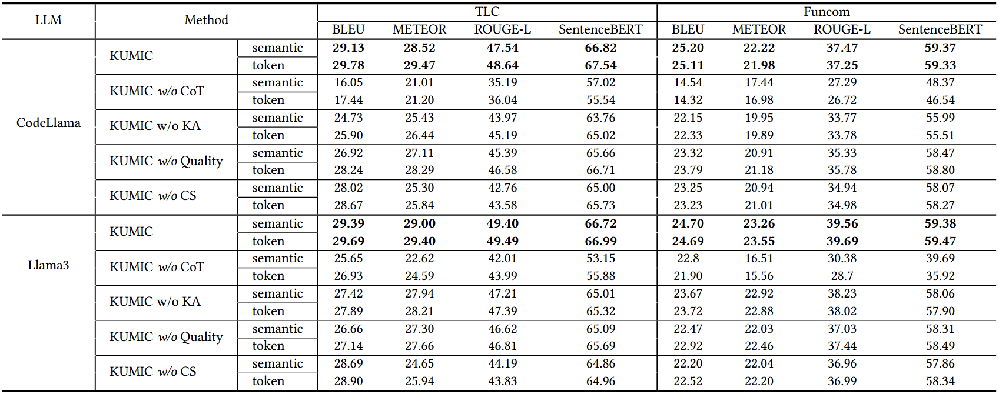
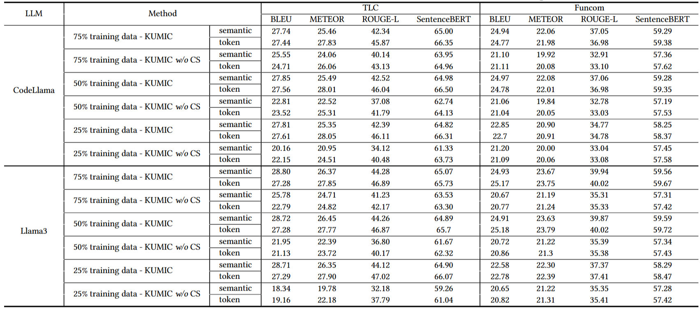

<!-- # 
Optimizing Knowledge Utilization for Multi-Intent Comment Generation with Large Language Modelsss

Our paper is available on -->

# De-duplication
This is the implementation of KUMIC ( Optimizing Knowledge Utilization for Multi-Intent Comment Generation with Large Language Models ).

## Abstract

Code comment generation aims to produce a generic overview of a code snippet, helping developers better understand and maintain code.
However, generic summaries alone are insufficient to meet the diverse needs of practitioners; for example, developers expect the implementation insights to be presented in an untangled manner, while users seek clear usage instructions.
This highlights the necessity of multi-intent comment generation.
With the widespread adoption of Large Language Models (LLMs) for code-related tasks, these models have been leveraged to tackle the challenge of multi-intent comment generation. 
Despite their successes, state-of-the-art LLM-based approaches often struggle to construct correct relationships among intents, code, and comments within a smaller number of demonstration examples.
To mitigate this issue, we propose a framework named KUMIC for multi-intent comment generation.
Built upon in-context learning, KUMIC leverages Chain-of-Thought (CoT) to optimize knowledge utilization for LLMs to generate intent-specific comments.
Specifically, KUMIC first designs a retrieval mechanism to obtain similar demonstration examples, which exhibit high code-comment consistency.
Then, KUMIC leverages CoT to guide LLMs to focus on statements facilitating the derivation of code comments aligned with specific intents.
In this context, KUMIC constructs a mapping knowledge chain — linking code to intent-specific statements to comments — which enables LLMs to follow similar reasoning steps when generating the desired comments.
We conduct extensive experiments to evaluate KUMIC, and the results demonstrate that KUMIC outperforms state-of-the-art baselines by 14.49\%, 22.41\%, 20.72\%, and 12.94\% in terms of BLEU, METEOR, ROUGE-L, and SBERT, respectively.

## Get Started
PyTorch 2.3.0 framework with Python 3.8. 
Experiments are conducted on a server equipped with four NVIDIA A800 GPU and 512 GB memory, running on Ubuntu 20.04.2.

OS: Ubuntu 20.04.  
package: PyTorch 2.3.0 framework with Python 3.8. 
The dataset we used are funcom.test, funcom.train, tlcodesum.test and tlcodesum.train.  

## Resultion. 
Despite their successes, state-of-the-art LLM-based approaches often struggle to construct correct relationships among intents, code, and comments within a smaller number of demonstration examples.
To mitigate this issue, we propose a framework named KUMIC for multi-intent comment generation.
Built upon in-context learning, KUMIC leverages Chain-of-Thought (CoT) to optimize knowledge utilization for LLMs to generate intent-specific comments.
Specifically, KUMIC first designs a retrieval mechanism to obtain similar demonstration examples, which exhibit high code-comment consistency.
Then, KUMIC leverages CoT to guide LLMs to focus on statements facilitating the derivation of code comments aligned with specific intents.
In this context, KUMIC constructs a mapping knowledge chain — linking code to intent-specific statements to comments — which enables LLMs to follow similar reasoning steps when generating the desired comments.
We conduct extensive experiments to evaluate KUMIC, and the results demonstrate that KUMIC outperforms state-of-the-art baselines by 18.37\%, 24.66\%, 22.25\%, and 12.95\% in terms of BLEU, METEOR, ROUGE-L, and SentenceBERT, respectively.

## Get Started
PyTorch 2.3.0 framework with Python 3.8. 
Experiments are conducted on a server equipped with four NVIDIA A800 GPU and 512 GB memory, running on Ubuntu 20.04.2.

OS: Ubuntu 20.04.  
package: PyTorch 2.3.0 framework with Python 3.8. 
The dataset we used are funcom.test, funcom.train, tlcodesum.test and tlcodesum.train.  

## Supplementary result
### The Supplementary Result of RQ1
Performances of KUMIC and baselines on each intent category on CodeLlama.

Performances of KUMIC and baselines on each intent category on Llama3.

Performances of KUMIC and baselines on each intent category on Qwen2.5-Coder.

### The Supplementary Result of RQ2
Ablation Experiment Results.

### The Supplementary Result of RQ3
Performances of KUMIC and KUMIC w/o CS on different scale of training data.

